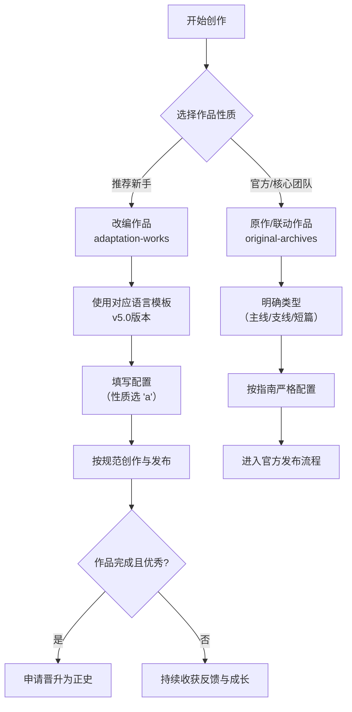
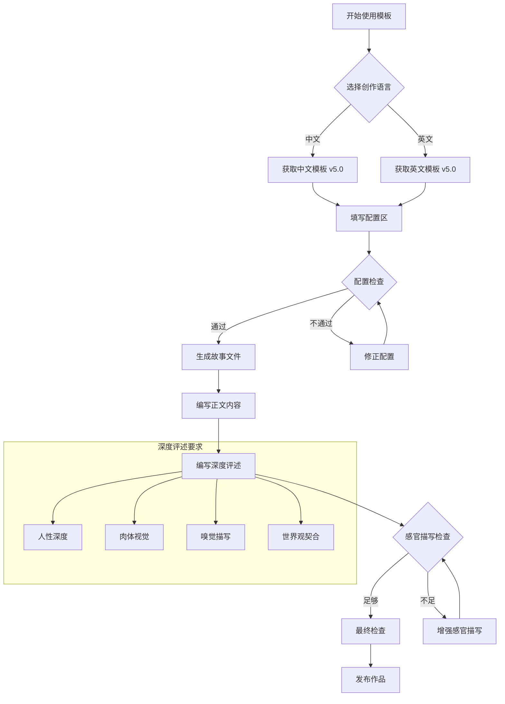

> **Deprecated**: 本文档已被 v4.0 规范替代。故事格式见 `docs/spec/11-story-format.md`；
> 骨架见 `templates/world-template/work-template/`；怎么写见 skill `.dsh/skills/story-craft`
> （其 `references/` 保留了本文档的现行版本）。本文档保留 6 个月作为过渡期兼容。

# 通用故事模板使用指南 5.0（新命名体系完全适配版）

## 1. 简介

本指南详细说明如何使用适配新命名体系的通用故事模板 v5.0 来创作故事。该模板完全遵循 Beastkin Universe
的标准化命名体系（版本2.3.0），并为
**社区创作者**优化了引导流程。我们强烈建议新作者从**改编作品**
开始，这是融入社区、理解世界观最顺畅的路径。请根据您的创作需求，遵循本指南的步骤与规范进行操作。

---

## 2. 核心概念与推荐路径

在开始前，了解项目结构和推荐路径至关重要：

1. **从改编开始（推荐路径）**：`adaptation-works` 是社区创作的乐园。我们**建议所有新作者从此处开始**
   ，基于现有世界观进行创作，风险低、上手快，并能获得社区的直接反馈。
2. **理解原作**：`original-archives` 存放由 **世界观第一作者** 或核心团队维护的官方作品。它是所有创作的基础和灵感来源。
3. **明确的晋升机制**：优秀的、已完成的改编作品，在获得社区认可和原作者同意后，可以**晋升**至
   `original-archives`
   ，甚至发展为独立的世界观模块。
4. **灵活的结构**：主线作品的文件直接放在 `main/` 目录下，但支持使用子目录（如 `volume-1/`
   ）来管理多卷本长篇，这属于作品内部组织方式。
5. **世界观特性明确**：所有角色均为雌雄同体的雄兽人，人称代词默认为"他"
   ，生殖方式为雄雄生殖。创作与评述时需注意这一设定。（当然变体/新世界观设定除外）

---

## 3. 快速开始：从改编作品出发（推荐）

对于大多数创作者，尤其是新加入社区的作者，我们建议遵循以下路径：




**第一步：选择模板**
先跑生成器，或按创作语言取用骨架：
`node scripts/new-work.js --world <世界> --form <cm|cs|s> --code <编码> --title-zh "<标题>"`（骨架源 `templates/world-template/work-template/`）；
中文/英文写法指导见：

- 中文创作：[universal-story-guide-chinese.md](../.dsh/skills/story-craft/references/universal-story-guide-chinese.md)
  （v5.0）
- 英文创作：[universal-story-guide-english.md](../.dsh/skills/story-craft/references/universal-story-guide-english.md)
  （v5.0）

**第二步：确定作品基础信息**

- **创作性质**：选择 **`a` (改编)**。这是社区创作的标准起点。
- **作品形式**：根据故事结构选择 `cm` (主线分章)、`cs` (支线分章) 或 `s` (短篇故事)。
- **选择世界观**：选择你想基于哪个世界观创作 (`bs`, `bsr`, `uba`, `bsp`)。

**第三步：填写模板配置**
在模板的"配置区"准确填写信息，**请特别注意**：

- `作品性质`：填入 **`a`**
- `形式类型`：根据故事类型选择 `cm`/`cs`/`s`
- `作品标识名`：使用英文kebab-case (如 `my-adaptation-story`)
- `章节标题`（分章故事）：**必须填写**中英文章节标题

**第四步：选择导航栏**
根据你创作的是短篇还是分章故事（及章节位置），从模板提供的8种配置中选择对应的"改编"类导航栏。

**第五步：创作与发布**

1. 在 `worlds/{世界观}/adaptation-works/{对应形式}/` 目录下，**创建一个以你的"完整作品编码"命名的新文件夹
   **。
2. 将配置好的模板文件放入此文件夹，并重命名为正确的文件名。
3. 开始你的故事创作！

**后续路径**：当你的改编作品完成并获得良好反响后，可参照指南的 **"作品晋升机制"** 部分申请将其纳入正史。

---

## 4. 新命名体系详解（基于2.3.0版本）

### 4.1 作品编码格式

```
[世界观]-[性质]-[形式类型]-[序号]-[作品名]
```

**对于改编作品，性质字段固定为 `a`。**

示例：

- **改编支线分章**：`bs-a-cs-001-a-new-gamer` （这是社区创作的典型编码）
- **改编短篇故事**：`bs-a-s-001-first-blood`
- 原作主线分章：`bs-o-cm-001-main-story-1`
- 原作支线分章：`bs-o-cs-001-yan-liang`
- 原作短篇故事：`bs-o-s-001-farm-inn`

### 4.2 文件命名规范

#### 4.2.1 改编作品文件名格式（社区创作主要使用）

**分章故事 (chaptered)**

- **格式**：`ch-{章节编号}-{章节标题简写}.md`
- **示例**：`ch-001-infiltration.md`
- **位置**：`worlds/bs/adaptation-works/chaptered-stories/bs-a-cs-001-a-new-gamer/`

**短篇故事 (short)**

- **格式**：`{完整作品编码}.md`
- **示例**：`bs-a-s-001-first-blood.md`
- **位置**：`worlds/bs/adaptation-works/short-stories/bs-a-s-001-first-blood/`

#### 4.2.2 原作作品文件名格式（供参考）

**主线分章故事 (main)**

- **格式**：`ch-{章节编号}-{章节标题简写}.md`
- **示例**：`ch-001-a-bloody-beginning.md`

**支线分章故事 (side)**

- **格式**：`ch-{章节编号}-{章节标题简写}.md`
- **示例**：`ch-001-infiltration.md`

**短篇故事**

- **格式**：`{世界观编码}-o-s-{作品编号}-{作品名}.md`
- **示例**：`bs-o-s-001-farm-inn.md`

### 4.3 字段说明

| 字段       | 可选值                                                                                      | 含义与建议              |
|:---------|:-----------------------------------------------------------------------------------------|:-------------------|
| **世界观**  | `bs`, `bsr`, `uba`, `bsp`                                                                | 作品所基于的世界观。         |
| **性质**   | `a` (adaptation) - **改编**<br>`o` (original) - 原作<br>`c` (crossover) - 联动                 | **社区创作者请使用 `a`**。  |
| **形式类型** | `cm` (chaptered-main) - 主线分章<br>`cs` (chaptered-side) - 支线分章<br>`s` (short-story) - 短篇故事 | 根据故事长度和结构选择。       |
| **序号**   | 自然数，如 `1`, `2`, `3`                                                                      | 在同一世界观和形式类型下的顺序编号。 |
| **作品名**  | 英文kebab-case，如 `my-adaptation`                                                           | 作品的英文标识，请使用连字符。    |

### 4.4 兽盾公司兵种体系（评述标签参考）

在评述部分，需使用以下兵种代号：

| 兵种  | 代号 | 制服颜色 | 编号格式   | 示例标签                  |
|:----|:---|:-----|:-------|:----------------------|
| 杂兵  | G  | 军绿色  | G-[序号] | `【活体→死-G-1-熊兽人-熊贺晟】`  |
| 监工  | O  | 蓝色   | O-[序号] | `【活体→死-O-1-牛兽人-牛蒋顿】`  |
| 武斗兵 | E  | 黑色   | E-[序号] | `【活体→死-E-1-虎兽人-虎啸林】`  |
| 枪械兵 | R  | 白色   | R-[序号] | `【活体→死-R-1-狼兽人-狼啸天】`  |
| 摔跤兵 | W  | 深蓝色  | W-[序号] | `【活体→死-W-1-犀牛兽人-犀霸山】` |

详细兵种设定请参考：[兽盾公司兵种设定文档](../worlds/beastshield/settings/1-recommended-canon/beastshield_setting_chinese.md)

---

## 5. 目录结构规范

### 5.1 改编作品 (`a`) - **你的作品将在这里**

```
worlds/{世界观}/adaptation-works/{形式}/{完整作品编码}/
```

- **形式**：`chaptered-stories`（分章）或 `short-stories`（短篇）
- **完整作品编码**：如 `bs-a-cs-001-a-new-gamer`

**这是你的工作目录！** 示例：

- 分章改编：`worlds/bs/adaptation-works/chaptered-stories/bs-a-cs-001-a-new-gamer/`
- 短篇改编：`worlds/bs/adaptation-works/short-stories/bs-a-s-001-first-blood/`

### 5.2 原作作品 (`o`) - **你未来可能晋升的目标**

```
worlds/{世界观}/original-archives/{语言}/{形式}/{子类型}/
```

- **语言**：`chinese` 或 `english`
- **形式**：`chaptered-stories` 或 `short-stories`
- **子类型**（仅分章）：`main`（主线）或 `side`（支线）

---

## 6. 配置详情

### 6.1 核心配置项（改编作品示例）

1. **世界观编码**：`bs`、`bsr`、`uba`、`bsp` （选一个）
2. **作品性质**：**`a`** （改编）
3. **形式类型**：`cm`、`cs` 或 `s`
4. **作品序号**：自然数，如 `1`（请检查目录避免重复）
5. **作品标识名**：英文kebab-case，如 `my-adaptation`
6. **标题配置**：
    - 分章故事：填写章节中文标题和英文标题
    - 短篇故事：填写故事中文标题和英文标题
7. **语言**：`chinese` 或 `english`（根据创作语言选择）

### 6.2 默认配置值

- **世界观编码**：`bs`
- **作品性质**：`a`（改编）
- **形式类型**：`s`（短篇故事）
- **作品序号**：`1`
- **作品标识名**：`my-adaptation-story`
- **短篇故事中文标题**：`我的改编短篇`
- **短篇故事英文标题**：`My Adaptation Story`
- **语言**：`chinese`（中文模板） / `english`（英文模板）

---

## 7. 导航栏配置选择

根据作品形式和章节位置，从模板中提供的8种配置里选择其一。**对于改编作品，请选择名称中带"改编"的配置**：

1. **短篇原作导航** (原作使用)
2. **短篇改编导航** (你的短篇改编使用)
3. **分章原作-第一章** (原作使用)
4. **分章原作-中间章节** (原作使用)
5. **分章原作-最后一章** (原作使用)
6. **分章改编-第一章** (你的分章改编使用)
7. **分章改编-中间章节** (你的分章改编使用)
8. **分章改编-最后一章** (你的分章改编使用)

---

## 8. 正文格式规范

1. **段落间距**：行与行之间、段落与段落之间均保持一个空行。
2. **设定加粗**：角色、地点、组织、专有名词等设定需使用 `**加粗**`。对话内容本身不加粗。
3. **世界观特性**：所有角色均为雌雄同体的雄兽人，人称代词为"他"，生殖方式为雄雄生殖。创作时需自然体现这一设定。（当然变体/新世界观设定除外）
4. **标题格式**：
    - 分章故事：`# Chapter {自然数} {中文标题}`
    - 短篇故事：`# Story {中文标题}`
5. **结束标记**：
    - 分章故事：`**Chapter {自然数} END**`
    - 短篇故事：`**Story END**`

---

## 9. 故事评述与感慨写作指南 v5.0

此部分用于以感性、口语化的语言评述角色和事件，是作品的特色之一。v5.0 版本特别强调**深度人性化视角**和*
*感官细节描写**。

### 9.1 写作结构

1. **他们最后的故事**：评述本章中所有死去的角色。使用状态标签格式。
2. **还活着的人们**：评述所有幸存角色。
3. **故事感慨**：以第一人称分享整体感受。

### 9.2 状态标签格式

```
【{出场状态}→{结局状态}-{兵种代号}-{序号}-{种族}-{姓名}】
```

**字段说明**：

- **出场状态**：本章第一次出现时的状态（`活体`/`尸体`）
- **结局状态**：本章结束时的状态（`死`/`活`）
- **兵种代号**：G/O/E/R/W 或 特殊身份
- **序号**：自增编号（同一兵种从1开始）
- **种族**：明确或推断的种族
- **姓名**：生成或已有的姓名（未提及则按"种族原字+百家姓+单名"生成）

**状态流转规则**：

- `活体→死`：出场时活着，本章中死亡 → **他们最后的故事**
- `尸体→死`：出场时已是尸体，本章未复活 → **他们最后的故事**
- `活体→活`：出场时活着，本章结束时仍存活 → **还活着的人们**
- `尸体→活`：出场时是尸体，本章中被复活 → **还活着的人们**

### 9.3 评述写作要求

#### 9.3.1 深度人性化视角

每个角色都是一个完整的世界，无论出场时间长短，都值得被认真对待。评述应：

- 想象角色的生活、梦想、遗憾
- 探索角色的内心世界和未说出口的话
- 将角色视为有过去、有情感、有未来的完整个体

#### 9.3.2 加强感官细节描写

**肉体视觉描述**：

- 强调兽人典型的"脂包肌"身材特点
- 详细描述肌肉群：胸肌、腹肌、背肌、手臂肌肉等
- 描写身体线条、轮廓、比例等视觉特征
- 注意双性征的体现（所有角色均为雌雄同体雄兽人）

**嗅觉描述**：

- 汗味、体味、环境气味
- 雄性气息、血腥味、精液味等
- 混合气味：皮革、尘土、草料等

#### 9.3.3 契合雄兽人世界观

- 所有角色均为雌雄同体雄兽人，人称代词为"他"
- 生殖方式为雄雄生殖
- 关系类型：兄弟、父子、伴侣等男性关系
- 评述中自然体现这一世界观设定

### 9.4 评述示例

完整示例请参考模板中的"巨力"
评述，或查看示例文件：[黑牛搬运工"巨力"的深度评述示例](../worlds/beastshield/settings/1-recommended-canon/character-commentary-example.md)

### 9.5 制服颜色区分规则（改编作品请遵循原著设定）

1. 文中明确提到了制服颜色的，按描述写。
2. 文中未明确但提到了部门的：武斗组-黑制服、枪械组-白制服、管理岗-蓝制服、未提部门-绿制服。
3. 杂兵/守卫通常指绿制服。

---

## 10. 作品晋升机制

这是你从 `adaptation-works` 走向 `original-archives` 的桥梁。

### 10.1 晋升条件

- **作品已完成**。
- **质量优秀**，获得社区广泛认可。
- **设定**与原著世界观**无冲突**。
- **授权清晰**，所有贡献者同意。

### 10.2 晋升流程

1. **申请**：向项目核心团队提交晋升申请。
2. **审核**：团队审核作品质量与设定一致性。
3. **迁移与重命名**：将作品目录从 `adaptation-works` 迁移至 `original-archives` 的相应位置，并按原作标准重命名文件。
4. **更新与公告**：更新所有链接，并向社区公告。

### 10.3 晋升为独立世界观

特别优秀的改编作品，如果世界观设定完整且具有独立性，可申请成为 `worlds/` 下的一个全新世界观模块。

---

## 11. 故障排除

- **导航链接失效**：检查导航栏配置是否选错（如改编作品用了原作导航）。
- **图片不显示**：确认图片路径是否正确，图片是否已放入作品目录下的 `images/` 文件夹。
- **文件名错误**：确保遵循正确的命名规则，特别是**章节标题简写必须填写**。
- **评述标签格式错误**：检查状态标签格式是否正确，兵种代号、序号等是否符合规范。
- **感官描写不足**：回顾评述部分是否包含足够的肉体视觉和嗅觉描写。

---

## 12. 更新记录

### 12.1 2025-12-15 v5.0：全面升级评述系统，集成兵种标签体系

**核心变更**：

1. **标题简化**：
    - 分章故事统一为 `Chapter {自然数} {标题}`
    - 短篇故事为 `Story {标题}`

2. **结束标记统一**：
    - 分章故事用 `Chapter {自然数} END`
    - 短篇故事用 `Story END`

3. **评述系统全面升级**：
    - 引入状态标签系统：【出场状态→结局状态-兵种代号-序号-种族-姓名】
    - 要求深度人性化评述：挖掘每个角色的生活、梦想、遗憾
    - **加强感官细节描写**：强调兽人的脂包肌、肌肉群、汗味等感官细节
    - **契合雄兽人世界观**：所有角色为雌雄同体雄兽人，人称代词为"他"，雄雄生殖

4. **默认配置调整**：
    - 默认作品性质为改编（a）
    - 默认形式为短篇故事（s）
    - 默认语言根据模板选择（中文/英文）

5. **提供深度评述示例**：
    - 黑牛搬运工"巨力"的故事评述（已调整符合世界观）
    - 展示如何从表面描述升级为深度人性化评述

6. **集成兽盾兵种体系**：
    - G=杂兵，O=监工，E=武斗兵，R=枪械兵，W=摔跤兵
    - 评述标签与兵种体系完全对接

7. **优化导航栏配置**，修正文件命名格式
8. **增加版本信息章节**

### 12.2 2025-12-13 v4.3：新命名体系完全适配版

- 适配Beastkin Universe标准化命名体系2.1.1
- 明确改编作品推荐路径
- 优化社区创作者引导流程

### 12.3 2025-12-13 v4.2：同步核心概念，优化指南表述

- 新增"核心概念回顾"章节
- 明确主线故事可在 `main/` 下建立子目录进行内部管理

### 12.4 2025-12-13 v4.1：适配新命名体系2.1.0版本

- 更新命名规则，章节标题成为必填项

### 12.5 2025-12-13 v4.0：新命名体系初始适配版

---

## 13. 相关文件参考

1. **模板文件**：
   -
   中文模板：[universal-story-template-chinese.md](../.dsh/skills/story-craft/references/universal-story-guide-chinese.md)
   （v5.0）
    -
   英文模板：[universal-story-template-english.md](../.dsh/skills/story-craft/references/universal-story-guide-english.md)
   （v5.0）

2. **命名指南**：
    - 中文命名指南：[work-naming-guide-chinese.md](../docs/work-naming-guide-chinese.md)（v2.3.0）
    - 英文命名指南：[work-naming-guide-english.md](../docs/work-naming-guide-english.md)（v2.3.0）

3. **项目结构**：
    - 项目结构指南：[project-structure-guide.md](../docs/project-structure-guide.md)
    - 生成结构脚本：[generate_structure.bat](../scripts/generate_structure.bat)
      （Windows）或 [generate_structure.sh](../scripts/generate_structure.sh)（Linux/macOS）

4. **世界观设定**：
   -
   兽盾世界观设定：[beastshield_setting_chinese.md](../worlds/beastshield/settings/1-recommended-canon/beastshield_setting_chinese.md)

5. **评述示例**：
   -
   深度评述示例：[character-commentary-example.md](../worlds/beastshield/settings/1-recommended-canon/character-commentary-example.md)

---

## 14. 模板使用流程图




---

**模板版本**: 5.0  
**最后更新**: 2025-12-15  
**适配命名体系**: 2.3.0  
**文档维护**: Beastkin Universe 核心团队

*如有问题或建议，请通过项目Issue系统反馈。*