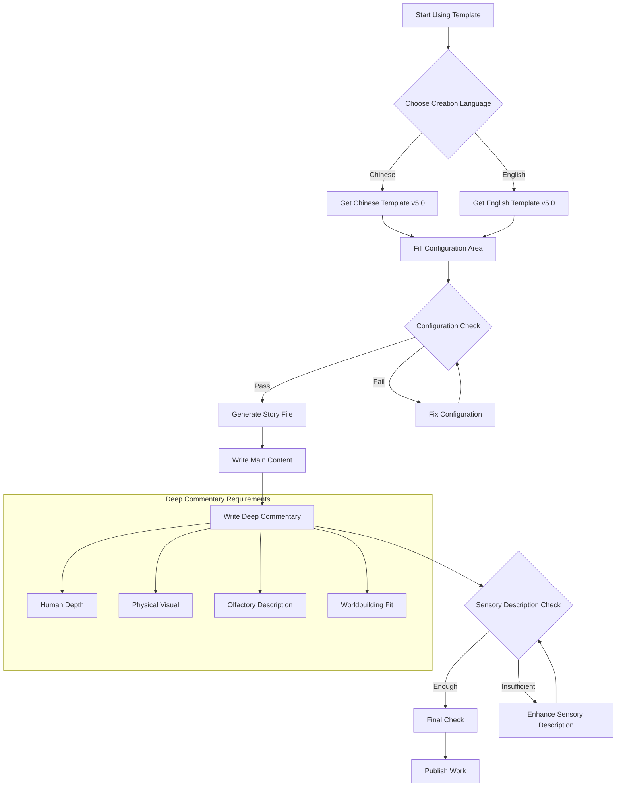

# Universal Story Template User Guide v5.0 (New Naming System Fully Adapted)

## 1. Introduction

This guide provides detailed instructions on how to use the Universal Story Template v5.0 adapted to
the new naming
system. The template fully follows the Beastkin Universe standardized naming system (version 2.3.0)
and is optimized for
the workflow of **community creators**. We strongly recommend new authors start with **adaptation
works**, as it is the
smoothest path to integrate into the community and understand the worldbuilding. Please follow the
steps and
specifications in this guide according to your creative needs.

---

## 2. Core Concepts & Recommended Path

Before starting, understanding the project structure and recommended path is crucial:

1. **Start with Adaptations (Recommended Path)**: `adaptation-works` is the playground for community
   creations. We *
   *recommend all new authors begin here**, creating works based on existing worlds. It's lower
   risk, easier to start,
   and allows for direct community feedback.
2. **Understand Original Works**: `original-archives` stores official works maintained by the **
   world's original author
   ** or the core team. It is the foundation and inspiration for all derivative creations.
3. **Clear Promotion Mechanism**: Excellent, completed adaptation works that gain community
   recognition and original
   author approval can be **promoted** to `original-archives`, or even develop into independent
   world modules.
4. **Flexible Structure**: Main storyline files are placed directly in the `main/` directory, but
   the use of
   subdirectories (e.g., `volume-1/`) is supported to manage multi-volume works. This is considered
   an internal
   organizational method.
5. **Worldbuilding Features Clarified**: All characters are hermaphroditic male beastmen, default
   pronouns are "he",
   reproduction is male-male. This setting should be noted during creation and commentary. (Of
   course, variant/new
   worldbuilding settings are exceptions)

---

## 3. Quick Start: Beginning with Adaptation Works (Recommended)

For most creators, especially those new to the community, we recommend following this path:


```mermaid
flowchart TD
    A[Start Creating] --> B{Choose Work Nature};
    B -- Recommended for Beginners --> C[Adaptation Work<br>adaptation-works];
    B -- For Official/Core Team --> D[Original/Crossover Work<br>original-archives];
    
    C --> E[Use Corresponding Language Template<br>v5.0 Version];
    E --> F[Fill Configuration<br>(Nature must be 'a')];
    F --> G[Create & Publish per Guidelines];
    G --> H{Is Work Completed & Excellent?};
    H -- Yes --> I[Apply for Promotion to Canon];
    H -- No --> J[Continue Receiving Feedback & Growing];
    
    D --> K[Determine Type<br>(Main/Side/Short)];
    K --> L[Configure Strictly per Guide];
    L --> M[Enter Official Publishing Process];
```

**Step 1: Select Template**
Run the generator, or take the skeleton by language:
`node scripts/new-work.js --world <world> --form <cm|cs|s> --code <code> --title-zh "<Title>"` (skeleton source:
`templates/world-template/work-template/`). Writing guidance:

- For Chinese
  creation: [universal-story-guide-chinese.md](../.dsh/skills/story-craft/references/universal-story-guide-chinese.md) (
  v5.0)
- For English
  creation: [universal-story-guide-english.md](../.dsh/skills/story-craft/references/universal-story-guide-english.md) (
  v5.0)

**Step 2: Determine Basic Work Information**

- **Work Nature**: Choose **`a` (adaptation)**. This is the standard starting point for community
  creation.
- **Form Type**: Choose `cm` (chaptered-main), `cs` (chaptered-side), or `s` (short-story) based on
  your story's
  structure.
- **Select World**: Choose which world you want to base your work on (`bs`, `bsr`, `uba`, `bsp`).

**Step 3: Fill in the Template Configuration**
Accurately fill in the information in the template's "Configuration Area". **Please pay special
attention to**:

- `Work Nature`: Enter **`a`**
- `Form Type`: Choose `cm`/`cs`/`s` based on story type
- `Work Identifier`: Use English kebab-case (e.g., `my-adaptation-story`)
- `Chapter Title` (for chaptered stories): **Must fill in** Chinese and English chapter titles

**Step 4: Select Navigation Bar**
Based on whether you are creating a short story or a chaptered story (and its position), select the
corresponding "
Adaptation" navigation bar from the eight configurations provided in the template.

**Step 5: Create and Publish**

1. Under the `worlds/{world}/adaptation-works/{corresponding-form}/` directory, **create a new
   folder named with your "
   Complete Work Code"**.
2. Place the configured template file into this folder and rename it to the correct filename.
3. Start writing your story!

**Future Path**: Once your adaptation work is complete and receives positive feedback, you can refer
to the **"Work
Promotion Mechanism"** section to apply for its inclusion into the official canon.

---

## 4. New Naming System Details (Based on Version 2.3.0)

### 4.1 Work Code Format

```
[world]-[nature]-[form-type]-[number]-[work-name]
```

**For adaptation works, the nature field is fixed as `a`.**

Examples:

- **Adaptation side chaptered**: `bs-a-cs-001-a-new-gamer` (This is a typical code for community
  works)
- **Adaptation short story**: `bs-a-s-001-first-blood`
- Original main chaptered: `bs-o-cm-001-main-story-1`
- Original side chaptered: `bs-o-cs-001-yan-liang`
- Original short story: `bs-o-s-001-farm-inn`

### 4.2 File Naming Conventions

#### 4.2.1 Adaptation Work File Name Format (Primarily used for community creation)

**Chaptered Stories (chaptered)**

- **Format**: `ch-{chapter-number}-{chapter-title-short}.md`
- **Example**: `ch-001-infiltration.md`
- **Location**: `worlds/bs/adaptation-works/chaptered-stories/bs-a-cs-001-a-new-gamer/`

**Short Stories (short)**

- **Format**: `{complete-work-code}.md`
- **Example**: `bs-a-s-001-first-blood.md`
- **Location**: `worlds/bs/adaptation-works/short-stories/bs-a-s-001-first-blood/`

#### 4.2.2 Original Work File Name Format (For reference)

**Main Chaptered Stories (main)**

- **Format**: `ch-{chapter-number}-{chapter-title-short}.md`
- **Example**: `ch-001-a-bloody-beginning.md`

**Side Chaptered Stories (side)**

- **Format**: `ch-{chapter-number}-{chapter-title-short}.md`
- **Example**: `ch-001-infiltration.md`

**Short Stories**

- **Format**: `{world-code}-o-s-{work-number}-{work-name}.md`
- **Example**: `bs-o-s-001-farm-inn.md`

### 4.3 Field Descriptions

| Field         | Possible Values                                                                                                     | Meaning & Suggestion                                                    |
|:--------------|:--------------------------------------------------------------------------------------------------------------------|:------------------------------------------------------------------------|
| **World**     | `bs`, `bsr`, `uba`, `bsp`                                                                                           | The world the work is based on.                                         |
| **Nature**    | `a` (adaptation) - **Adaptation**<br>`o` (original) - Original<br>`c` (crossover) - Crossover                       | **Community creators please use `a`**.                                  |
| **Form Type** | `cm` (chaptered-main) - Main chaptered<br>`cs` (chaptered-side) - Side chaptered<br>`s` (short-story) - Short story | Choose based on story length and structure.                             |
| **Number**    | Natural number, e.g., `1`, `2`, `3`                                                                                 | The serial number within similar works of the same world and form type. |
| **Work Name** | English kebab-case, e.g., `my-adaptation`                                                                           | The English identifier for the work. Please use hyphens.                |

### 4.4 Beast Shield Company Troop System (Commentary Tag Reference)

In the commentary section, use the following troop codes:

| Troop    | Code | Uniform Color  | Number Format | Example Tag                                      |
|:---------|:-----|:---------------|:--------------|:-------------------------------------------------|
| Grunt    | G    | Military green | G-[number]    | `【living→dead-G-1-Bear Beastman-Xióng Hè Shèng】` |
| Overseer | O    | Blue           | O-[number]    | `【living→dead-O-1-Ox Beastman-Niú Jiǎng Dùn】`    |
| Enforcer | E    | Black          | E-[number]    | `【living→dead-E-1-Tiger Beastman-Hǔ Xiào Lín】`   |
| Ranged   | R    | White          | R-[number]    | `【living→dead-R-1-Wolf Beastman-Láng Xiào Tiān】` |
| Wrestler | W    | Dark blue      | W-[number]    | `【living→dead-W-1-Rhino Beastman-Xī Bà Shān】`    |

Detailed troop settings please refer
to: [Beast Shield Company Troop Setting Document](../worlds/beastshield/settings/1-recommended-canon/beastshield_setting_english.md)

---

## 5. Directory Structure Specifications

### 5.1 Adaptation Works (`a`) - **Your work will be here**

```
worlds/{world}/adaptation-works/{form}/{complete-work-code}/
```

- **Form**: `chaptered-stories` (chaptered) or `short-stories` (short)
- **Complete Work Code**: e.g., `bs-a-cs-001-a-new-gamer`

**This is your working directory!** Examples:

- Chaptered adaptation: `worlds/bs/adaptation-works/chaptered-stories/bs-a-cs-001-a-new-gamer/`
- Short adaptation: `worlds/bs/adaptation-works/short-stories/bs-a-s-001-first-blood/`

### 5.2 Original Works (`o`) - **Your potential future promotion target**

```
worlds/{world}/original-archives/{language}/{form}/{subtype}/
```

- **Language**: `chinese` or `english`
- **Form**: `chaptered-stories` or `short-stories`
- **Subtype** (chaptered only): `main` (main) or `side` (side)

---

## 6. Configuration Details

### 6.1 Core Configuration Items (Adaptation Work Example)

1. **World Code**: `bs`, `bsr`, `uba`, `bsp` (choose one)
2. **Work Nature**: **`a`** (adaptation)
3. **Form Type**: `cm`, `cs`, or `s`
4. **Work Number**: Natural number, e.g., `1` (check directory to avoid duplicates)
5. **Work Identifier**: English kebab-case, e.g., `my-adaptation`
6. **Title Configuration**:
    - Chaptered story: Fill in chapter Chinese and English titles
    - Short story: Fill in story Chinese and English titles
7. **Language**: `chinese` or `english` (choose based on creation language)

### 6.2 Default Configuration Values

- **World Code**: `bs`
- **Work Nature**: `a` (adaptation)
- **Form Type**: `s` (short-story)
- **Work Number**: `1`
- **Work Identifier**: `my-adaptation-story`
- **Short Story Chinese Title**: `我的改编短篇`
- **Short Story English Title**: `My Adaptation Story`
- **Language**: `chinese` (Chinese template) / `english` (English template)

---

## 7. Navigation Bar Configuration Selection

Based on work format and chapter position, choose one of the eight configurations provided in the
template. **For
adaptation works, please select configurations with "Adaptation" in the name**:

1. **Short Original Navigation** (original works use)
2. **Short Adaptation Navigation** (your short adaptation use)
3. **Chaptered Original - First Chapter** (original works use)
4. **Chaptered Original - Middle Chapters** (original works use)
5. **Chaptered Original - Final Chapter** (original works use)
6. **Chaptered Adaptation - First Chapter** (your chaptered adaptation use)
7. **Chaptered Adaptation - Middle Chapters** (your chaptered adaptation use)
8. **Chaptered Adaptation - Final Chapter** (your chaptered adaptation use)

---

## 8. Text Formatting Specifications

1. **Paragraph Spacing**: Maintain one blank line between lines and between paragraphs.
2. **Bold for Settings**: Elements like characters, locations, organizations, and proper nouns must
   be bolded using
   `**bold**`. Dialogue itself should not be bolded.
3. **World Feature**: All characters are hermaphroditic male beastmen, pronouns are "he",
   reproduction is male-male.
   This should be naturally reflected in creation. (Of course, variant/new worldbuilding settings
   are exceptions)
4. **Title Format**:
    - Chaptered story: `# Chapter {natural number} {Chinese title}`
    - Short story: `# Story {Chinese title}`
5. **End Mark**:
    - Chaptered story: `**Chapter {natural number} END**`
    - Short story: `**Story END**`

---

## 9. Story Commentary and Reflection Writing Guide v5.0

This section is used to comment on characters and events in emotional, conversational language, and
is a distinctive
feature of the works. Version 5.0 particularly emphasizes **deep human perspective** and **sensory
detail description**.

### 9.1 Writing Structure

1. **Their Final Stories**: Comment on all deceased characters in this chapter. Use state tag
   format.
2. **The People Still Alive**: Comment on all surviving characters.
3. **Story Reflection**: Share your overall feelings in first person.

### 9.2 State Tag Format

```
【{appearance state}→{outcome state}-{troop code}-{number}-{race}-{name}】
```

**Field Descriptions**:

- **Appearance State**: Character's state when first appearing in this chapter (`living`/`corpse`)
- **Outcome State**: Character's state at chapter end (`dead`/`alive`)
- **Troop Code**: G/O/E/R/W or special identity
- **Number**: Incremental number (starting from 1 for same troop type)
- **Race**: Explicit or inferred race
- **Name**: Generated or existing name (if not mentioned, generate using "race character + Chinese
  surname + single
  name")

**State Transition Rules**:

- `living→dead`: Appeared alive, died in chapter → **Their Final Stories**
- `corpse→dead`: Appeared as corpse, not revived in chapter → **Their Final Stories**
- `living→alive`: Appeared alive, still alive at chapter end → **The People Still Alive**
- `corpse→alive`: Appeared as corpse, revived in chapter → **The People Still Alive**

### 9.3 Commentary Writing Requirements

#### 9.3.1 Deep Human Perspective

Each character is a complete world, regardless of screen time, deserving to be taken seriously.
Commentary should:

- Imagine the character's life, dreams, regrets
- Explore the character's inner world and unspoken words
- Treat the character as a complete individual with past, emotions, and future

#### 9.3.2 Enhance Sensory Detail Description

**Physical Visual Description**:

- Emphasize beastmen's typical "fat-wrapped muscle" physique
- Describe muscle groups in detail: chest, abs, back, arm muscles, etc.
- Describe body lines, contours, proportions and other visual features
- Note dual sexual characteristics (all characters are hermaphroditic male beastmen)

**Olfactory Description**:

- Sweat, body odor, environmental scents
- Masculine scent, blood, semen, etc.
- Mixed scents: leather, dust, fodder, etc.

#### 9.3.3 Fit Male Beastmen Worldbuilding

- All characters are hermaphroditic male beastmen, pronouns are "he"
- Reproduction is male-male
- Relationship types: brothers, father-son, partners and other male relationships
- Naturally reflect this worldbuilding in commentary

### 9.4 Commentary Example

Complete example please refer to the "Jù Lì" commentary in the template, or view the example
file: [Black Ox Mover "Jù Lì" Deep Commentary Example](../worlds/beastshield/settings/1-recommended-canon/character-commentary-example.md)

### 9.5 Uniform Color Differentiation Rules (Adaptation works should follow original settings)

1. If text explicitly mentions uniform color, write according to description.
2. If not explicitly mentioned but department is mentioned: Combat Group - black uniform, Firearms
   Group - white
   uniform, Management - blue uniform, no department mentioned - green uniform.
3. Common soldiers/guards usually refer to green uniform.

---

## 10. Work Promotion Mechanism

This is your bridge from `adaptation-works` to `original-archives`.

### 10.1 Promotion Conditions

- The work is **completed**.
- **High quality**, widely recognized by the community.
- **Settings** have **no conflict** with the original world.
- **Clear authorization**, all contributors agree.

### 10.2 Promotion Process

1. **Application**: Submit a promotion application to the project core team.
2. **Review**: The team reviews work quality and setting consistency.
3. **Migration & Renaming**: Move the work directory from `adaptation-works` to the appropriate
   location in
   `original-archives`, and rename files according to original work standards.
4. **Update & Announcement**: Update all links and announce to the community.

### 10.3 Promotion to Independent World

Particularly excellent adaptation works, if they have complete independent setting systems, can
apply to become a brand
new world module under `worlds/`.

---

## 11. Troubleshooting

- **Navigation Links Not Working**: Check if the correct navigation bar configuration is selected (
  e.g., using an
  original navigation for an adaptation work).
- **Images Not Displaying**: Confirm the image path is correct and the image file exists in the
  `images/` folder within
  your work directory.
- **Incorrect Filenames**: Ensure following correct naming rules, especially that **chapter title
  short form must be
  filled in**.
- **Commentary Tag Format Error**: Check if state tag format is correct, troop codes, numbers, etc.
  comply with
  specifications.
- **Insufficient Sensory Description**: Review if commentary section contains enough physical visual
  and olfactory
  description.

---

## 12. Update History

### 12.1 2025-12-15 v5.0: Comprehensive Commentary System Upgrade, Integrated Troop Tag System

**Core Changes**:

1. **Title Simplification**:
    - Chaptered stories unified as `Chapter {natural number} {title}`
    - Short stories as `Story {title}`

2. **Unified End Markers**:
    - Chaptered stories use `Chapter {natural number} END`
    - Short stories use `Story END`

3. **Comprehensive Commentary System Upgrade**:
    - Introduced state tag system: 【Appearance State→Outcome State-Troop Code-Number-Race-Name】
    - Requires deep humanized commentary: Explore each character's life, dreams, regrets
    - **Enhanced sensory detail description**: Emphasize beastmen's fat-wrapped muscle, muscle
      groups, sweat scent and
      other sensory details
    - **Fit male beastmen worldbuilding**: All characters are hermaphroditic male beastmen, pronouns
      are "he", male-male
      reproduction

4. **Default Configuration Adjustment**:
    - Default work nature is adaptation (a)
    - Default form is short story (s)
    - Default language based on template selection (Chinese/English)

5. **Provided Deep Commentary Examples**:
    - Black ox mover "Jù Lì" story commentary (adjusted to fit worldbuilding)
    - Show how to upgrade from surface description to deep humanized commentary

6. **Integrated Beast Shield Troop System**:
    - G=Grunt, O=Overseer, E=Enforcer, R=Ranged, W=Wrestler
    - Commentary tags fully connected to troop system

7. **Optimized navigation bar configuration**, corrected file naming formats
8. **Added version information section**

### 12.2 2025-12-13 v4.3: New Naming System Fully Adapted Version

- Adapted to Beastkin Universe standardized naming system 2.1.1
- Clarified adaptation work recommended path
- Optimized community creator guidance process

### 12.3 2025-12-13 v4.2: Synchronized Core Concepts, Optimized Guide Wording

- Added "Core Concepts Review" section
- Clarified that main stories can use subdirectories under `main/` for internal organization

### 12.4 2025-12-13 v4.1: Adapted to New Naming System 2.1.0 Version

- Updated naming rules, chapter titles made mandatory

### 12.5 2025-12-13 v4.0: New Naming System Initial Adapted Version

---

## 13. Related File References

1. **Template Files**:
    - Chinese
      Template: [universal-story-template-chinese.md](../.dsh/skills/story-craft/references/universal-story-guide-chinese.md) (
      v5.0)
    - English
      Template: [universal-story-template-english.md](../.dsh/skills/story-craft/references/universal-story-guide-english.md) (
      v5.0)

2. **Naming Guides**:
    - Chinese Naming Guide: [work-naming-guide-chinese.md](../docs/work-naming-guide-chinese.md) (
      v2.3.0)
    - English Naming Guide: [work-naming-guide-english.md](../docs/work-naming-guide-english.md) (
      v2.3.0)

3. **Project Structure**:
    - Project Structure Guide: [project-structure-guide.md](../docs/project-structure-guide.md)
    - Generate Structure Script: [generate_structure.bat](../scripts/generate_structure.bat) (
      Windows)
      or [generate_structure.sh](../scripts/generate_structure.sh) (Linux/macOS)

4. **Worldbuilding Settings**:
    - Beast Shield Worldbuilding
      Setting: [beastshield_setting_english.md](../worlds/beastshield/settings/1-recommended-canon/beastshield_setting_english.md)

5. **Commentary Examples**:
    - Deep Commentary
      Example: [character-commentary-example.md](../worlds/beastshield/settings/1-recommended-canon/character-commentary-example.md)

---

## 14. Template Usage Flowchart




---

**Template Version**: 5.0  
**Last Updated**: 2025-12-15  
**Adapted Naming System**: 2.3.0  
**Document Maintenance**: Beastkin Universe Core Team

*If you have questions or suggestions, please provide feedback through the project Issue system.*